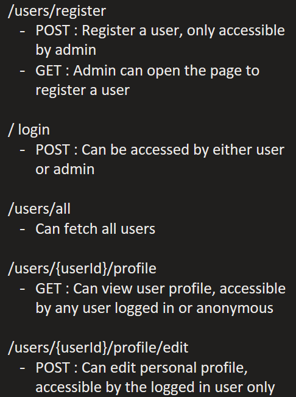

### Endpoints

### Useful resources and references

* CDI - https://blog.payara.fish/getting-started-with-jakarta-ee-9-context-and-dependency-injection-cdi
* Generating Password Hash - https://howtodoinjava.com/java/java-security/how-to-generate-secure-password-hash-md5-sha-pbkdf2-bcrypt-examples/
* Hibernate configuration - https://medium.com/@mainul35/configuring-hibernate-with-spring-mvc-49e8a646e462
* Send JSON response: https://stackoverflow.com/questions/9645647/return-json-from-servlet